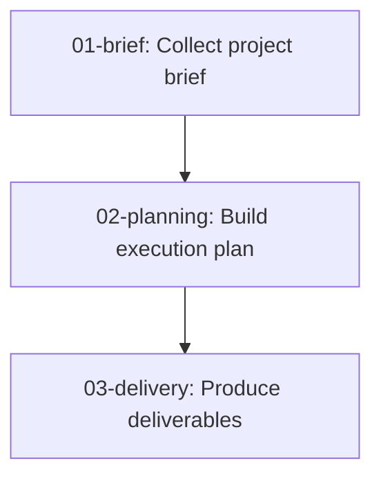

# Workflow Diagram Instructions

## Purpose

Use these instructions when the user wants a visual Mermaid diagram of a workflow that already exists in `workflows/`.

The goal is to help the user understand the workflow structure, step order, and dependencies at a glance.

## Required Inputs

- The relevant workflow step folders under `workflows/NN-name/`
- Each step's `inputs.md`
- Each step's `instructions.md`

Optional inputs:

- A user-provided workflow title
- A user-provided output filename for the diagram
- A request to visualize only part of the workflow instead of the full sequence

## Output Location

Write the diagram as a Markdown file inside `resources/`.

Default filename rules:

- If the workflow has a clear name, use `resources/<workflow-name>-diagram.md`
- Otherwise use `resources/workflow-diagram.md`

The output file should contain a Mermaid code block and, when needed, a short note describing any assumptions used to build the diagram.

## Diagram Creation Procedure

Follow this sequence:

1. Identify the workflow scope the user wants to visualize.
2. Read the relevant step folders in numeric order.
3. Inspect each step's `inputs.md` to determine upstream dependencies.
4. Inspect each step's `instructions.md` to understand the step objective and expected outputs.
5. Create one Mermaid node per workflow step.
6. Connect nodes using arrows that reflect the actual execution order and dependency chain.
7. Include external input nodes only when they help explain where user-provided or repository-provided inputs enter the workflow.
8. Save the finished diagram in `resources/`.

## Mermaid Requirements

Use `flowchart TD` unless the user explicitly asks for a different Mermaid diagram type.

The diagram should:

- Show the main workflow from top to bottom
- Use concise node labels
- Preserve the workflow step number in each step node
- Reflect actual dependencies from the workflow files
- Avoid inventing steps, outputs, or edges that are not supported by the workflow definition
- Stay readable instead of copying long instructions into the diagram

Preferred node label shape:

- `NN-name: short action`

Example:



## Interpretation Rules

When turning workflow files into a diagram:

- Treat references to `outputs/NN-name/` in `inputs.md` as dependency edges
- Treat required user-provided inputs as external inputs
- Treat repository files used directly by a step as external context only when they materially improve clarity
- If one step can branch into multiple downstream steps, show the branching explicitly
- If the dependency order is ambiguous, do not guess silently; add a short assumption note below the Mermaid block

## Output Format

The generated file in `resources/` should usually follow this structure:

    # Workflow Diagram

    ```mermaid
    flowchart TD
    ...
    ```

    ## Notes

    - Assumption: ...

If there are no assumptions, omit the `Notes` section.

## Guardrails

- Do not modify workflow definition files while creating the diagram
- Do not place the diagram inside `workflows/`
- Do not place the diagram inside `outputs/`
- Do not invent missing dependencies
- Do not use overly verbose node text that makes the diagram hard to read
- Do create or update files only inside `resources/` for this task unless the user explicitly asks for changes elsewhere

## Quality Bar

The diagram is complete when:

- Every relevant workflow step is represented
- The execution order is clear
- The dependency chain matches the workflow files
- The user can understand the workflow structure quickly by reading the diagram
