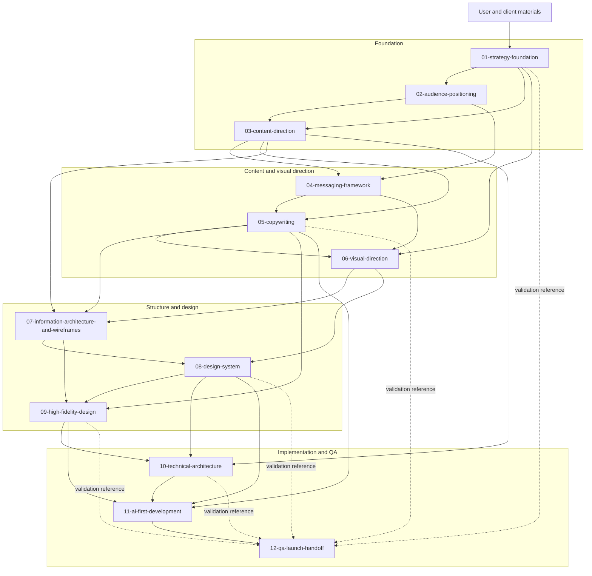

# Workflow Diagram

## Notes

- `03-content-direction` and `06-visual-direction` each pause for user approval before their approved downstream artifacts are finalized.
- `12-qa-launch-handoff` also reviews earlier approved strategy, copywriting, design-system, high-fidelity-design, and technical outputs as validation references.
